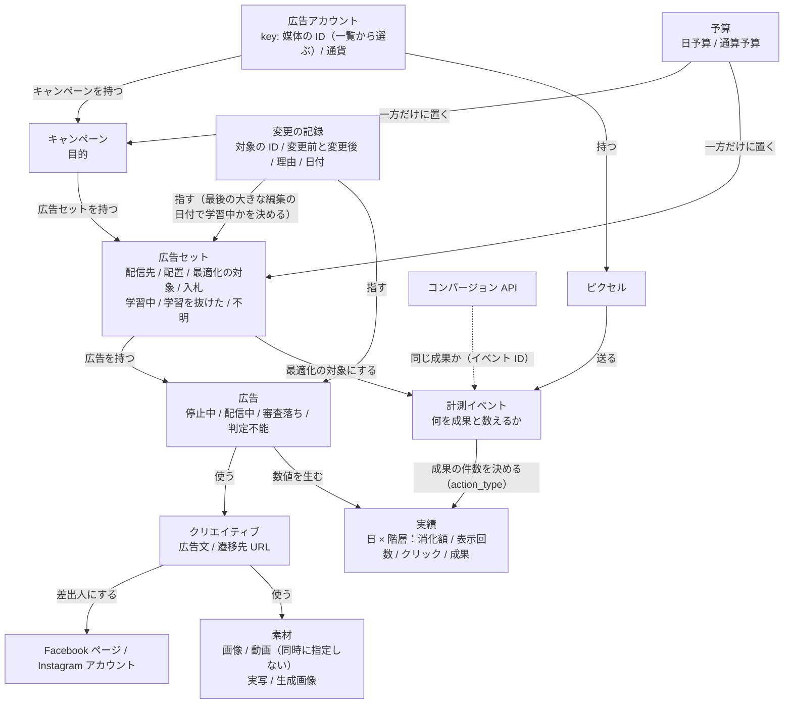

# Meta 広告の設計と運用

何を作るか・いつ何を変えるかを決め、決めた内容を媒体に反映し、実績を取る。自動入札では、誰に・いくらで広告を出すかは
媒体が決める。この Skill が受け持つのはその外側（何を成果と数えるか、目標 CPA と予算、どのクリエイティブを出すか）と、
その実行。目標 CPA や変更幅の数値は Skill に書き込まず、依頼文と案件の参照資料（`cpa-budget-plan` の表）から読む。
経路は Meta の公式 MCP（参照と書き込みができる。執筆時点）を第一候補にする。

## オントロジー（出てくるモノと関係）

答えられるようにする問い:

- この広告はいま配信中か、停止中か、審査落ちか
- この広告セットはいま学習中か（最後に大きな編集をしたのはいつか）
- 先週の成果は何件で、どの `action_type` を成果と数えたか



点線は、ピクセルとコンバージョン API から送った成果を、イベント ID で突き合わせる線。この図に無いエンティティと矢印は作らない。

- 広告アカウント（媒体の ID。一覧から選ぶ）→ キャンペーン → 広告セット → 広告 → クリエイティブ → 素材
- キャンペーンで目的を、広告セットで配信先・配置・最適化の対象・入札を決める。予算はキャンペーンか広告セットの一方だけに置く
- 広告は状態を持つ（停止中 / 配信中 / 審査落ち / 判定不能）。状態を取得できないときは判定不能とし、停止中や成果 0 件とみなさない
- 広告セットの学習の状態は、変更の記録の「最後の大きな編集の日付」から決める。日付が分からなければ「不明」
- 成果は計測イベントで決まる。ピクセルとコンバージョン API が同じイベント ID を付けた 2 件は、同じ 1 件
- 実績は日ごと・階層ごとに持つ。率は媒体の値を使わず、分子と分母から計算し直す

## 配信前に確かめる

媒体とつないだ直後に「いま、どこまで頼めるか」を一覧で確かめる。どれも管理画面でしか直せない。
確かめられなかった項目は「未設定」ではなく「不明」と書く。

- **入稿に要る設定**: 支払い方法、ピクセル（成果を数える計測タグ）、Instagram アカウントの割り当て、Facebook ページの広告の権限
- **計測に要る設定**: ビジネス設定とドメインの認証、ピクセルの発火、コンバージョン API、最適化するイベント（CV の定義）
- **数値**: 目標 CPA と月予算、学習に要る件数が 1 週間で埋まるか

計測できていなければ成果を数えられず、件数が足りなければ学習が終わらない。どちらかが欠けたまま配信開始へ進まない。

## 入稿の前に確定すること

作成には確認画面が出ないので、決まっていない値のまま作らない。足りなければ聞く。

- 広告アカウント（一覧から選ぶ）、目的と、成果として数えるもの
- 予算の額と置き場所（日予算か通算か、キャンペーン側か広告セット側か）
- 配信地域・年齢などの配信先、素材（実写か生成画像か）、広告文、遷移先の URL

「出しておいて」を配信開始まで含む指示と読まない。月の予算を勝手に日予算へ割り戻さない（割り戻した値を見せて確認する）。

## 手順（設計から初回の配信まで）

1. **広告アカウントを一覧から選ぶ**（ID を手入力させない）。アカウント名と通貨を見せて選んでもらう
2. **目的**を選ぶ（認知・検討・購入のどの段階か。成果として数える行動に合わせる）
3. **予算の置き場所**を決める（キャンペーン側か広告セット側の一方だけ。少額のテストは広告セット側）
4. **配信先と配置**を決める。早い段階で絞り込みすぎない。配置は自動配置を基本にする。
   オーディエンスの種類と目安は `references/meta-ads-knowledge.md`
5. **入稿前に点検する**（`references/meta-ads-knowledge.md` のチェックリスト）。広告文に成果の約束や使用前後の比較が無いかを
   点検して伝える（審査するのは媒体なので、作成は止めない）
6. **一式（キャンペーン・広告セット・素材・広告）を停止状態（`PAUSED`）で、1 回の呼び出しで作る**（確認は不要）。
   呼ぶ前に、作る内容を日本語の箇条書きで見せる。必須の項目が 1 つでも欠けていれば、何も作らずに、
   足りない項目の一覧を返す。必須項目とエラーの読み方は `references/campaign-bundle.md`
7. **配信開始**は、作成の結果を見せてから別に依頼を受け、確認画面を通す（次の「配信開始・予算の変更・停止」）
8. **初回の配信**は、配信する相手と入札額を指定した設定で始め、目標に近い単価の成果がたまってから自動入札に切り替える
   （新しいアカウントには、媒体が配信先を選ぶもとになる成果データが無い）

設計は表（項目・設定値・根拠）で返す。

## 配信開始・予算の変更・停止

- **配信開始と予算の変更は、作成とは別のツールにして、確認画面を通す**。確認画面に出るのはツールの名前と引数だけなので、
  呼ぶ前に「何を・どのアカウントの・どの ID を・いくらに」を返答に書く。予算の変更は変更前と変更後を並べて見せ、
  対象が学習中でないかも伝える。設定の書き方は `references/permissions-settings.md`
- **停止は確認なしでよい**が、対象の名前と ID を復唱してから呼ぶ
- **クリエイティブの差し替え**は、新しいクリエイティブと新しい広告を停止状態で作り、新しい広告の配信開始で確認を取る。
  既存の広告の中身は書き換えない。古い広告は、許可のあとに停止する

## 実績を取る

確認は不要。読み取りのツールだけを使い、日ごとの細かさで最後のページまで取る。
`ctr` はパーセントで返るが、率は媒体の値を使わず分子と分母から計算し直す。成果は `actions` の `action_type` から
案件の定義に合うものを選ぶ。取れなければ「連携が未設定」と報告する。

## 運用の規則

1. **学習期間中は触らない**。大きな編集（一時停止、オーディエンス・クリエイティブ・最適化の対象の変更、
   幅の大きい予算や入札の変更）は学習をやり直しにする。成果の件数が足りないときは、中間の行動（予約フォームを開いた、
   電話ボタンを押した）を最適化の対象にし、広告セットを 1 つにまとめる。それでも足りないときは撤退ラインで判断する
2. **変えるのは 1 回に 1 箇所**。予算の変更幅に上限を置く（幅は案件の参照資料で決める。例は 1 回 20% 以内）
3. **書き込みのたびに変更の記録を残す**（誰の接続か・いつ・何を・対象の ID・変更前と変更後・理由・結果）。
   次の判断に使う「最後の大きな編集の日付」はここから読む
4. **審査落ちは 1 回に 1 箇所ずつ直して切り分ける**。順番は、媒体の説明を読む（誤判定と考えられるなら再審査を申し立てる）
   → クリエイティブの冒頭・テロップ・素材のうち 1 箇所 → 遷移先のページの表現 → 広告文の表現を弱める。
   審査を回避するための加工はしない
5. **値を動かす判断は、消化のペースと成果の付き方の両方を見てから**

| 消化のペース | 成果 | 読み取れること | 施策 |
|---|---|---|---|
| 速い | 少ない | 単価の高い配信先にまで広がっている | 目標 CPA を下げる |
| 遅い | ついている | 目標が厳しく、配信先が狭くなっている | 目標 CPA を少し上げる |
| 遅い | ついていない | 配信が始まっていないか、審査や計測に問題がある | 入札より先に、審査の状態と計測タグを確かめる |
| 予定どおり | 目標どおり | 安定している | 触らない。増額するなら少しずつ |

消化のペースは 1 日の消化額ではなく 7 日の合計で見る（自動入札は日ごとに増減する）。
管理画面の成果が実際の予約より少ない案件で目標 CPA を下げると配信が止まりやすいので、入札を変える前にこのずれを確かめる。

## 守ること

- フィールド名は公式リファレンスで確かめてから使う（推測で足さない）
- 金額の単位は通貨ごとに確定させる。予算は通貨の最小単位で渡す（円は `6000` = 6,000 円、ドルは `5000` = 50.00 ドル）。
  公式の通貨の表に無い通貨では、予算の操作を止める
- CV が 0 件のときに CPA を 0 とみなさない（優良な広告に見える）
- 消化額が少ないうちに良し悪しを判定しない。毎日の数字の上下に合わせて毎日設定を変えない
- 広告の配信状態と、取得の成否を同じ項目で返さない
- 確認画面で断られた操作は、別の方法で実行しない。断られたことを報告して止まる
- 失敗しても自動で作り直さない。同じ内容での呼び直しは 1 回まで。最低額に届かなくても勝手に増額しない
- 同じ成果を二重に数えない。ピクセルとコンバージョン API の両方に同じイベント ID を付ける。
  成果を送るための認証情報をページの JavaScript に書かず、計測 ID に仮の値を入れない

## 出力の型

- 配信前の点検: 項目ごとに「済 / 未対応 / 不明」と、直す場所
- 作成の結果:

```markdown
## 作成した内容（すべて停止状態）
- 広告アカウント: <名前>（<ID>）/ 通貨: JPY
- キャンペーン: <名前>（<ID>）目的: … / 予算: （置いていない / 日予算 … 円）
- 広告セット: <名前>（<ID>）日予算: 2,000 円 / 配信地域: … / 最適化の対象: …
- クリエイティブ: <名前>（<ID>）素材: 実写 3 枚
- 広告: <名前>（<ID>）遷移先: …
- 呼ぶ前の点検: 成果を約束する表現 = なし / 学習期間 = 対象外（新規）
- 配信開始: まだ行っていない（依頼を受けてから、確認画面を通して行う）
```

- 途中で落ちたとき: 作成済みの ID、落ちた手順、エラーの本文、次にすること
- 実績: 期間・階層・取得日時・取得経路・成果として数えた `action_type` を先頭に書く
- 運用の提案: 表（対象の名前と ID・いまの状態・読み取れること・施策・確認の要否）。増額と配信開始は「確認が要る」と書く
- 審査落ち: 当たったポリシー、原因の仮説、次に変える 1 箇所

## フォールバック先

- 書き込みの経路が無い: 入稿内容の設計書（キャンペーン構成・配信先・予算・広告文・素材の割り当て）を返し、人が管理画面で入稿する
- 実績が取れない: 「広告マネージャ → レポート → 期間 = 〇〇、内訳 = 日別・広告セット別、列 = 消化額・表示回数・クリック数・
  成果の件数 を CSV で書き出してください」と 1 回で頼むか、利用者が貼った数字で判断する。取得経路を書き、
  取れなかった数字は「未取得」と書く
- 公式 CLI / 公式 API の認証情報しか無い: 読み取りに使う。書き込みをターミナルから行うと確認画面を通らないので行わない
- 配信前の点検を確かめる手段が無い: 管理画面で確かめる項目のチェックリストを渡し、確かめていない項目は「不明」のまま残す
- 目標 CPA が決まっていない: 値を作らず、`cpa-budget-plan` を先に通す
- 最後の大きな編集の日付が分からない: 判定せずに「学習中かどうか不明」と書き、管理画面の変更履歴の確認を頼む

媒体ごとの単位と語彙の違いは `${CLAUDE_PLUGIN_ROOT}/skills/ad-operation/references/platform-differences.md`。
