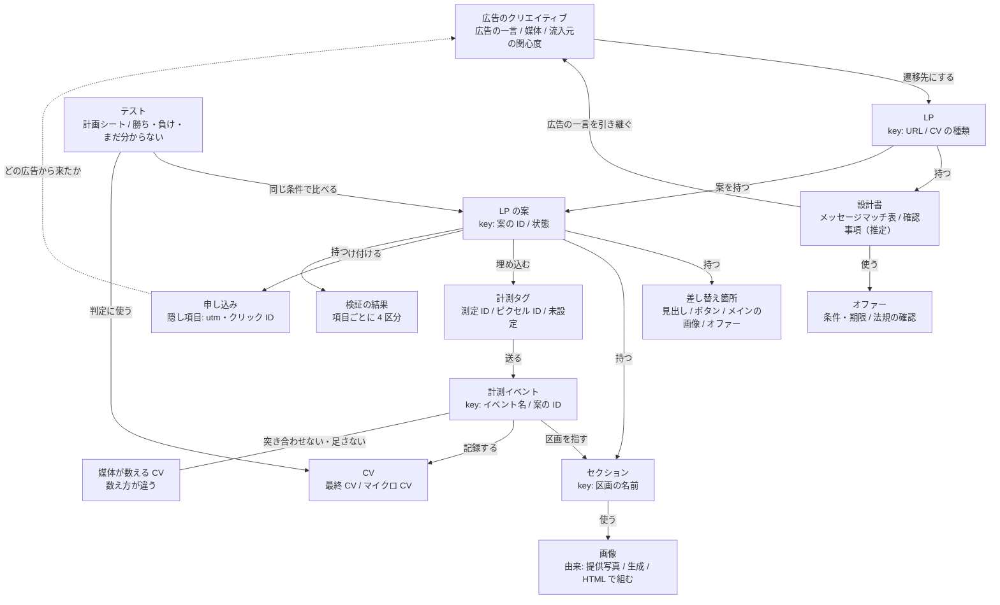

# 広告の遷移先 LP を作る

LP の成否を決めるのは、メッセージマッチ（広告と LP で同じことを言っているか）と、成果を正しく計測できているかの 2 点。

## 最初に確定すること

- 実装の形は 1 つの HTML ファイル（ビルド不要）が既定。スマホの幅を先に作る。出力先は `<出力先>/lp/`
- 「LP を改善して」と頼まれたときは、この Skill ではなく lp-improve を使う
- 計測タグだけを頼まれたときは、「計測タグを入れる・確かめる」の節から入る（LP は作り直さない）

## オントロジー（出てくるモノと関係）



- LP（URL）は設計書を 1 つ、案（案の ID）を複数持つ。案は、差し替え箇所・セクション・画像（由来: 提供写真 / 生成 / HTML で組む）・計測タグ・検証の結果を持つ
- 計測イベントには必ず案の ID を付ける。申し込みには utm とクリック ID を残し、どの広告から来たかをたどる
- 媒体が数える CV は数え方が違う。LP の計測イベントと突き合わせず、足さない
- この図に無いエンティティと矢印は作らない。lp-improve もこの図を読む（図はここ 1 箇所に置く）

## 手順

0. 前工程の成果物（第 3 章の分析・ad-copy のコピー案・reel-script の台本・offer-design の設計書）を先に読む。同じことを二度聞かない
1. 与件を 1 回だけ確認する: CV の種類 / 流入元の広告（媒体・広告の一言・関心度）/ オファー / 使える素材 / 計測 ID / バリアント数（既定は 2 案）。
   答えが得られない自動実行では推定で埋め、設計書の冒頭に「確認事項（推定）」として列挙する。計測 ID は「無い」として扱う
2. 設計書を書く（HTML より先。`design.md`。様式は `references/lp-design.md`）。必須: メッセージマッチ表、セクション構成、CTA の位置、
   フォーム項目と削った理由、想定される離脱ポイント。SNS 広告から来る潜在層には縦長、検索広告から来る顕在層にはフォームやボタンを上に置いた短い構成にする
3. 単体 HTML で実装する（骨組みは `references/lp-skeleton.md`）。8 つの基準（見出し・申し込みボタン・裏付け・今申し込む理由・
   信頼・フォーム・スマホ表示・表示速度）を満たす
   - 差し替える箇所は `<!-- lp:headline -->…<!-- /lp:headline -->` のようなコメントで囲む。既定は `headline` / `subcopy` / `cta` / `kv` / `offer`
   - CV の発火と計測イベントは、「計測タグを入れる・確かめる」の「必ず入れるもの」に従う
   - 申し込みボタンはファーストビュー・中ほど・最後に置き、スマホでは画面の下に固定する
   - 案ごとにディレクトリを分ける（`a/` が元の案）。納品書類（README）は案の下に置かず、`lp/` の直下に 1 つ
4. 画像: 実店舗・実スタッフ・実料理は提供素材だけを使う。生成してよいのは抽象的な背景と装飾（image-video-gen）。
   文字が主役の図（料金表など）は HTML で組む。生成した画像を使ったら README に「生成画像」と書く
5. 計測タグ: 「計測タグを入れる・確かめる」の手順で入れる。ID があれば埋め込む。無ければダミーを入れず、プレースホルダを残して、
   README の冒頭に「計測未設定。このまま配信すると成果が計測できない」と書く
6. 検証: 同じ節の静的チェックと実発火チェックを行い、結果の `status` と `notes` を読む
7. バリアントを作る（複数の案を作るとき）。1 つの案で変えるのは 1 か所だけ（複数変えるとスクリプトが警告する）。
   各案は `?lp=<案の ID>` で区別する（スクリプトが `window.LP_VARIANT` を入れる）

```bash
# バリアントの作成（定義は YAML。PyYAML が無い環境では JSON で書く。--json では失敗しても終了コード 0 なので error を読む）
python3 "${CLAUDE_PLUGIN_ROOT}/skills/landing-page-builder/scripts/make_variants.py" \
  --base <出力先>/lp/a --spec <出力先>/lp/variants.yaml --out <出力先>/lp --json
```

```yaml
variants:
  - id: b
    note: 見出しを広告のテロップと同じ文言にする
    slots:
      headline: "昼休みにカット、会社から徒歩 3 分"
```

## 計測タグを入れる・確かめる

「入っている」と「送っている」は別なので、タグを入れたあと、ボタンを押してデータが送られることまで確かめる。
LP を作る手順 5・6 の中身で、既存の LP にタグだけを入れる・確かめるときもここから入る。

- 入力: LP の HTML ファイル、計測 ID（GTM のコンテナ ID `GTM-XXXXXXX` / GA4 の測定 ID `G-XXXXXXXXXX` / Meta のピクセル ID）、
  最終 CV の種類（予約完了・フォーム送信・LINE の友だち追加ボタン・電話番号のタップ）
- 扱うのは手元の HTML ファイル。管理画面（GA4・GTM・Meta）の設定や公開中のサイトへの反映は人が行う（必要な設定を一覧にして渡す）

入れ方は手元の ID で選ぶ（コードは `references/tag-snippets.md`）。

- GTM のコンテナ ID がある（推奨）: GTM のコンテナだけを埋め込み、GA4 と Meta ピクセルは GTM 側で管理する。
  申し込みは `dataLayer.push({event: 'cv', cv_name: 名前})` で送る
- GA4 の測定 ID や Meta のピクセル ID だけがある: gtag.js と fbq を直接貼る。
  申し込みで `gtag('event', 'generate_lead')` と `fbq('track', 'Lead')` を送る
- どちらも無い: ダミーの ID は入れない。`<!-- TODO: 計測未設定 -->` を残し、
  納品書類の冒頭に「計測未設定。このまま配信すると成果が計測できない」と書く

必ず入れるもの:

- 申し込みの送信は 1 つの関数（`trackCv`）にまとめ、タグはそこからだけ呼ぶ。各 CTA には `data-cv="<イベント名>"` を付ける
- URL の `utm_*`・`gclid`・`fbclid` を読み取り、フォームの隠し項目に入れる
- 計測イベントには LP の案の ID を付ける（`variant`）
- LP の中の動きを計測するイベント。名前は LP をまたいで固定する

| イベント | いつ送るか | パラメータ |
|---|---|---|
| `section_view` | 区画が画面に入ったとき（1 訪問につき区画ごとに 1 回） | `section`（`fv_below` / `price` / `voice` / `faq` / `cta_bottom` など）、`variant` |
| `cta_click` | CTA を押したとき | `position`（`fv` / `mid` / `bottom` / `sticky`）、`variant` |
| `form_start` | フォームに最初に触れたとき | `variant` |
| 最終 CV（`reserve_complete` など） | 予約完了・フォーム送信など | `variant` |

1. 与件から計測 ID を確認する。GA4 の測定 ID（`G-` で始まる）とプロパティ ID（数字だけ）を取り違えない。
   すでにタグが入っている LP は、先に静的チェックで今の状態を読む。ID が「無い・分からない」ときは「どちらも無い」の扱いで進める
2. 上の 3 通りから入れ方を選び、埋め込む
3. 静的チェック: タグ・申し込みの関数・隠し項目がそろっているかを確かめる（依存なし）
4. 実発火チェック: ブラウザで LP を開いて申し込みボタンを押し、GA4・GTM・Meta へのリクエストが実際に送られるかを確かめる
   （Playwright が必要。無いと実発火チェックは行われず、その旨が結果の `notes` に入る）
5. 人が管理画面で行う設定を一覧にして渡す: パラメータ（`section` / `position` / `variant`）の「カスタム ディメンション」への登録、
   最終 CV の「キーイベント」への登録、GTM のタグ・トリガー・変数。登録した日より前のデータは後から取れない

```bash
python3 "${CLAUDE_PLUGIN_ROOT}/skills/landing-page-builder/scripts/verify_tags.py" --path <出力先>/lp/a/index.html --json
python3 "${CLAUDE_PLUGIN_ROOT}/skills/landing-page-builder/scripts/verify_tags.py" --path <出力先>/lp/a/index.html --live --json
```

結果の `status` を項目ごとに読む: `ok` = 問題なし / `warn` = 改善余地 / `missing` = 欠落 / `todo` = 意図的な未設定。
`missing` が残るあいだは `ready_to_run_ads` が false になる。`--json` では失敗しても終了コード 0 なので、必ず `error` を読む。
実発火チェックで押すと計測サービスにテストのデータが送られる。公開前の LP で行う。

タグだけを頼まれたときは、計測の状態（入れたタグ / 未設定のタグ / 送る経路）、人が管理画面で行う設定の一覧、
検証の各項目（計測の経路・CTA の data-cv・trackCv への集約・広告のパラメータの引き継ぎ・フォームの送信先・実発火）を返す。

## 守ること

- 実在しない実績・受賞・お客様の声を書かない。「No.1」「最安」は、出典と調査条件を出せないなら書かない。
  表現に規制のある業種（医療・美容・健康食品など）は、コピーを確定する前に人の確認を通す
- フォームの送信先は、確定したものだけを書く。未定なら `action="#"` と `<!-- TODO: 送信先未確定 -->` を残す
- 計測タグを書いただけで終えない。書いたことと、送られることは別。実発火チェックをしていないのに「発火を確認した」と書かない。
  静的チェックだけなら「実発火は未確認」と書く
- ダミーの ID を入れない。プレースホルダ（`GTM-XXXXXXX` など）のまま「設定済み」と書かない
- 同じタグを二重に入れない（GTM の中で GA4 を管理しているのに、gtag も直接貼ると二重に数える）
- LP の計測イベントの数と、媒体が報告する CV の数は数え方が違う。突き合わせず、足さない
- API のシークレットは LP に書かない
- 本番公開（サーバーへの配置・ドメインの設定）はしない。人が行う

## 納品物

- 設計書（`design.md`）/ `index.html`（バリアントごと。`a/index.html`、`b/index.html`）/ 納品書類（`README.md`: 計測の状態・生成画像の有無・確認事項）
- 検証の各項目は「問題なし／改善余地／欠落／意図的な未設定」で書く。欠落が残るものを「完成」「配信できる」と書かない

## フォールバック先

- ブラウザが使えない: 静的チェックだけを行い、結果に「実発火は未確認」と書く。人が開発者ツールの「ネットワーク」で
  `collect`（GA4）・`gtm.js`（GTM）・`tr`（Meta）へのリクエストを確かめる手順を添える
- 計測 ID が無い: 「どちらも無い」の扱いにし、ID の発行手順を添えて返す（画面の名前は変わるので、公式のヘルプで確認する）
- Python を実行できない: HTML を読んで、`references/tag-snippets.md` の「確かめる項目」を 1 つずつ目で確かめる
- LP が HTML ファイルではない（CMS・ノーコードのサービス）: 入れるコードと、入れたあとに確かめる項目を渡し、設置は人が行う
- 画像生成の API キーが無い: HTML と CSS の装飾で組む。実在の写真の代わりに生成しない
- 素材が無い区画: 素材待ちで止めず、構成を変えて吸収する。足りない素材を一覧にして返す
